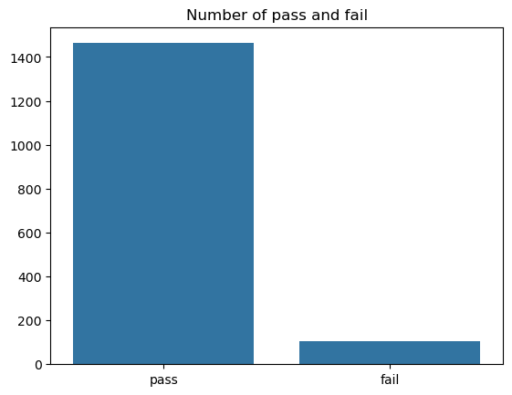
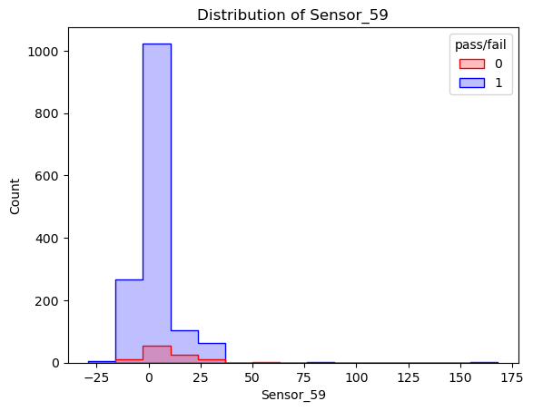
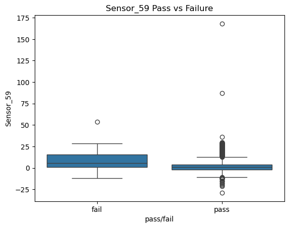
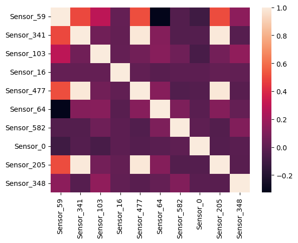
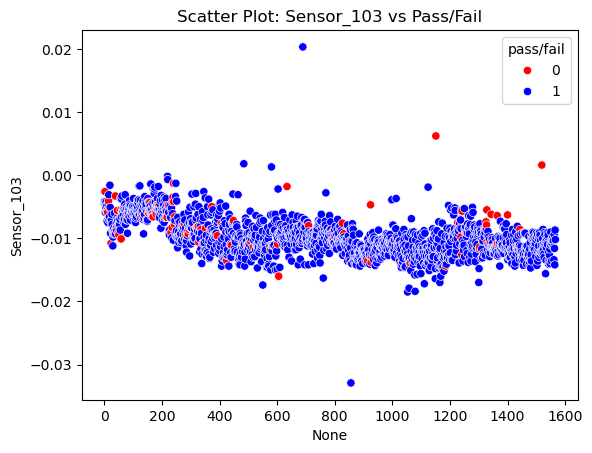
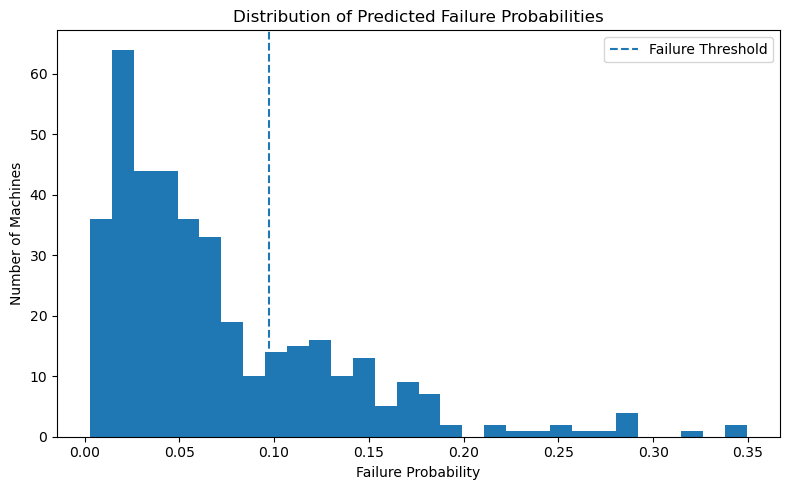

# SECOM — Semiconductor Manufacturing Failure Prediction

Predict **pass/fail** outcomes in semiconductor manufacturing from high-dimensional sensor data using a Random Forest classifier, with an interactive sensor drift simulator powered by ipywidgets.

---

## Overview

The SECOM dataset contains **1,567** samples with **591** sensor readings from a semiconductor manufacturing process. The goal is to predict whether a product will **pass or fail** quality checks. Challenges include high dimensionality, missing values, and extreme class imbalance (93:7 pass-to-fail).

---

## Dataset

| Property | Value |
|----------|-------|
| Source | [UCI ML Repository](https://archive.ics.uci.edu/dataset/179/secom) |
| Instances | 1,567 |
| Features | 591 (sensor readings) |
| Task | Binary classification |
| Labels | -1 = Pass, 1 = Fail |
| Missing values | Yes |

---

## Pipeline

```
Load Data → Drop columns with >50% NaN → Mean imputation → StandardScaler
→ Train/Test Split (75/25, stratified) → Random Forest (5,000 trees, class-weighted)
→ F2-threshold optimisation → Evaluate → Interactive drift simulation
```

---

## Results

### Class Distribution



Only **104 failures** out of 1,567 samples (93:7 ratio). Standard accuracy is misleading — the model uses `class_weight={0:4, 1:1}` and F2-score optimisation to handle this imbalance.

### Top 10 Most Important Sensors

| Rank | Sensor | Importance |
|------|--------|-----------|
| 1 | Sensor_59 | 0.0806 |
| 2 | Sensor_341 | 0.0167 |
| 3 | Sensor_103 | 0.0158 |
| 4 | Sensor_16 | 0.0127 |
| 5 | Sensor_477 | 0.0115 |
| 6 | Sensor_64 | 0.0109 |
| 7 | Sensor_582 | 0.0098 |
| 8 | Sensor_0 | 0.0094 |
| 9 | Sensor_205 | 0.0094 |
| 10 | Sensor_348 | 0.0089 |

**Sensor_59** is the dominant predictor with an importance score nearly **5× higher** than the second-ranked sensor.

### Dominant Sensor: Sensor_59


*Sensor_59 distribution: failures (red) show a broader range and higher values than passes (blue)*


*Sensor_59 boxplot: clearest inter-class separation of all sensors (median ~+10 fail vs ~0 pass)*

### Correlation Heatmap



### Temporal Drift: Sensor_103


*Sensor_103 shows a clear downward trend over the first ~800 samples (equipment wear-in), stabilising afterward. Monitoring such drift is critical for production deployment.*

### Failure Probability Distribution



Optimal F2 threshold: **0.0975** — the model catches **77% of failures** (recall) at the cost of low precision (19%). This trade-off is appropriate for manufacturing QC where missing a failure is far costlier than a false alarm.

---

## Interactive Sensor Drift Simulation

The notebook's final cell provides an ipywidgets dashboard that lets you:

- Select any subset of the top 10 important sensors via checkboxes
- Apply a percentage shift (-100% to +100%) via a slider
- Recompute risk levels (Low / Medium / High) based on percentiles
- Visualise the before/after risk distribution as a grouped bar chart

This demonstrates how small sensor deviations disproportionately impact predicted risk at scale.

---

## Requirements

```
numpy pandas matplotlib seaborn scikit-learn ipywidgets IPython
```

---

## Files

| File | Description |
|------|-------------|
| `SECOM.ipynb` | Full notebook with pipeline, visualisations, and interactive simulation |
| `secom.data` | Sensor data (590 columns, space-separated) |
| `secom_labels.data` | Labels (-1 pass, 1 fail) |
| `secom.names` | Dataset description (UCI format) |
| `images/` | Extracted notebook visualisations |

---

## Key Insights

1. **Sensor_59 dominates** — 5× the importance of any other sensor; should be under continuous surveillance in production.
2. **F2 optimisation is essential** — catches 77% of failures despite 93:7 imbalance by weighting recall over precision.
3. **Sensor redundancy** — correlated pairs (477↔205, 59↔341) can be consolidated.
4. **Temporal drift** — Sensor_103 shows clear wear-in behaviour; retraining or drift compensation is needed over time.
5. **Small drifts compound** — even modest sensor drift shifts risk profiles significantly at scale.
